```python
from __future__ import print_function
import numpy as np
import matplotlib.pyplot as plt
import statsmodels.tsa.arima_process as tsp
from statsmodels.sandbox.tsa.fftarma import ArmaFft as FftArmaProcess
import statsmodels.tsa.stattools as tss
from statsmodels.graphics.tsaplots import plot_acf

from math import *
from scipy import *
from cmath import *
from numpy import *
import numpy as np
import fileinput
import re
import pandas as pd
from scipy.interpolate import spline
from sklearn.metrics import *
#import seaborn as sns
from datetime import timedelta
import datetime
import calendar
import os
import matplotlib.ticker as ticker
#from wavelets import WaveletAnalysis
#get_ipython().magic('matplotlib inline')
#get_ipython().magic(u'pylab inline')
pd.options.mode.chained_assignment = None
%config InlineBackend.figure_format = 'svg'
```


```python
from optimizador_de_NR import *
```

    Populating the interactive namespace from numpy and matplotlib
    

    WARNING: pylab import has clobbered these variables: ['gamma', 'test', 'polar']
    `%matplotlib` prevents importing * from pylab and numpy
    


```python
def stack_cota(df,consistencia):
    """Recebe Dataframe de cotas da ANA (header=15) e retorna dataframe com cotas em colunas (Dia, Cota, Mes, Ano).
    Também recebe o Nível de Consistencia desejado (1 - Inconsistido, 2- Consistido)"""
    dfc = df[df.NivelConsistencia == consistencia]
    if consistencia == 1:
        dfc = dfc[dfc.MediaDiaria == 1]
    dfc.index = range(len(dfc))
    dft = dfc.ix[:,16:47]
    dft.index = dfc.Data
    dft.columns = range(1,32)
    df = dft
    print(len(df))
    if len(df)!=0:
        vert = pd.DataFrame(index = pd.date_range(dft.index.min(),add_months(dft.index.max(),1)))
        dfcol = pd.DataFrame(df.stack())
        dfcol.columns =  ['Data']
        dfcol.to_csv('temp.csv',sep='\t',header=['Cota'])
        vert.to_csv('temp2.csv',sep='\t')
        dateparse2 = lambda x: pd.datetime.strptime(x, '%Y-%m-%d')
        df = pd.read_csv('temp.csv',sep='\t', parse_dates=['Data'], date_parser=dateparse2)
        df.columns = ['Data', 'Dia', 'Cota']
        df.index = df.Data+ map(lambda x: timedelta(days=float(x)-1.), df.Dia.tolist())
        vert['Data'] = vert.index
        df['Data'] = df.index
        finalmente = pd.merge(vert,df,on='Data')
        finalmente = vert.join(df,lsuffix='_l',rsuffix='_r')
        finalmente['Mes'] = finalmente.index.month
        finalmente['Dia'] = finalmente.index.dayofyear
        finalmente['Ano'] = finalmente.index.year
        return finalmente
    else:
        return pd.Series(np.nan)
```

Here we define were pictures and tables should be saved.


```python
figuras = 'C:\\Users\\Usuario\\OneDrive\\Mestrado\\Artigos\\PIANC\\RN\\Dados\\Saida\\figuras\\'
tabelas = 'C:\\Users\\Usuario\\OneDrive\\Mestrado\\Artigos\\PIANC\\RN\\Dados\\Saida\\tabelas\\'
```

Here we define the river station that we want.


```python
estacao = 66825000
```

This defines a function for Date reading, defines the origin of the data, read the data, copy then into 2 separate groups (Consisted and Inconsisted) data, apply the Stack_cota function for both groups and then merge them (optional).


```python
dateparse = lambda x: pd.datetime.strptime(x, '%d/%m/%Y')
root = 'C:\\Users\\Usuario\\OneDrive\\Mestrado\\Artigos\\PIANC\\RN\\Dados\\Cotas\\'+str(estacao)
df = pd.read_csv(root+'\\COTAS.TXT',header=15,sep=';', parse_dates=['Data'], date_parser=dateparse,decimal=',')
inconsistido = stack_cota(df,1)
consistido = stack_cota(df,2)
cotg = merge_consistido(consistido,inconsistido)
```

    1395
    1247
    

THIS ROTINE MAKES THE YEARS START IN JULY. EX: JULY OF 1990 WILL NOW BE THE FIRST MONTH OF 1991.

TO ACCOMPLISH THAT IT GIVES TO ALL JULYS THE VALUE OF THE FOLLOWING YEAR IN THE ANO2 COLUMNS.


```python
cotg['new_year']=np.NAN
cotg['Ano2']=np.NAN
cotg['Ano2'] = cotg['Ano']
cotg['Ano2'][cotg.index.month>6] = np.array(cotg.Ano[cotg.index.month>6].tolist()) +1
aux = cotg.Ano-1
cotg['new_year'] = aux.astype('str')+cotg.Ano.astype('str')
cotg['new_year'][cotg.index.month>6] = cotg.Ano[cotg.index.month>6].astype('str')+ cotg.Ano2[cotg.index.month>6].astype('str')
```


```python
resumo =  cotg[cotg.Cota.notnull()].pivot_table(values = 'Cota', index=['Dia','Mes'], columns='Ano2')
r_stat = resumo.describe(percentiles=linspace(0,1,21)).T
```


```python
print(resumo.head(2))
```

    Ano2      1900   1901   1902   1903   1904   1905   1906   1907   1908   1909  \
    Dia Mes                                                                         
    1   1    186.0  191.0  168.0  141.0  240.0  298.0  190.0  150.0  168.0  210.0   
    2   1    185.0  193.0  172.0  140.0  240.0  300.0  190.0  151.0  168.0  210.0   
    
    Ano2     ...     2007   2008   2009   2010   2011  2012   2013   2014   2015  \
    Dia Mes  ...                                                                   
    1   1    ...    243.0  196.0  108.0  164.0  100.0  82.0  124.0  117.5  222.5   
    2   1    ...    245.0  196.0  107.0  164.0  100.0  82.0  126.0  116.0  222.0   
    
    Ano2      2016  
    Dia Mes         
    1   1    145.5  
    2   1    146.5  
    
    [2 rows x 117 columns]
    


```python
r_stat.tail(20).to_latex('asd.tex')
```


```python
plt.plot(cotg[cotg.Ano==2015].index,cotg[cotg.Ano==2015].Cota)
#plt.plot(cotg[cotg.Ano==2016].index,cotg[cotg.Ano==2016].Cota)
plt.xticks(rotation=90)
plt.savefig('2015.pdf',bbox_inches='tight')
```


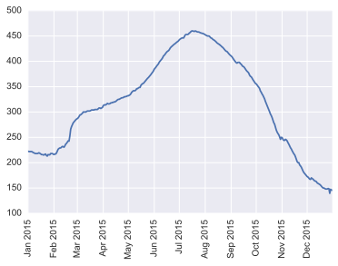


```python
#plt.plot(cotg[cotg.Ano==2015].index,cotg[cotg.Ano==2015].Cota)
plt.plot(cotg[cotg.Ano==2016].index,cotg[cotg.Ano==2016].Cota)
plt.xticks(rotation=90)
plt.savefig('2016.pdf',bbox_inches='tight')
```


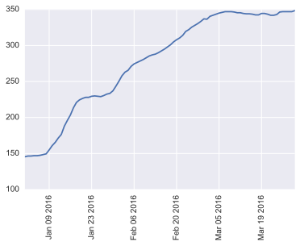


```python
T1Va=[40,1991,0,10]
T1Ta=[40,1991,10,10]

###SECOND (BASIC - DIFERENT PERIODS)

T2Va=[40,1996,0,5]
T2Ta=[40,1996,5,10]


###THIRD (COMBINATION - 2 FORECAST EVENTS)

T3Va=[40,1961,0,10]
T3Ta=[40,1961,10,10]

T3Vb=[40,1966,0,5]
T3Tb=[40,1966,5,10]

###FOURTH (COMBINATION - 2 FORECAST EVENTS)
T4Va=[40,1951,0,10]
T4Ta=[40,1951,10,10]

T4Vb=[40,1956,0,5]
T4Tb=[40,1956,5,10]

###FIFTH (TESTE WITH COMPLEX VARIATION)

T5Va=[40,1941,0,10]
T5Ta=[40,1941,10,10]

T5Vb=[40,1946,0,5]
T5Tb=[40,1946,5,10]
```


```python
parametros=[T1Va,
T1Ta,
T2Va,
T2Ta,
T3Va,
T3Ta,
T3Vb,
T3Tb,
T4Va,
T4Ta,
T4Vb,
T4Tb,
T5Va,
T5Ta,
T5Vb,
T5Tb]
```


```python
forecast_parameters = pd.DataFrame(pd.DataFrame(parametros).ix[[0,4,8,12],:].as_matrix())
```


```python
import foracast_models
```


```python
rc('font',family='Senasds Serif',size=10)
sns.set_style("darkgrid")
sns.set(palette="colorblind")
sns.set_context("paper")
```

## Basic Model - Percentil 20


```python
reload(foracast_models)

bm_20 = foracast_models.basic_forecast()

bm_20.set_parameters(forecast_parameters,20,r_stat,cotg)

bm_20.forecast(cotg)
```


```python
grid_kws = {"height_ratios": (.5,.5), "hspace": (0.40)}
f, ((ax,ax1),(ax2,ax3)) = plt.subplots(2,2, gridspec_kw=grid_kws,figsize=(10,5))
ax_t2 = [ax,ax1,ax2,ax3]
for i in range(len(forecast_parameters)):
    a = ax_t2[i]
    fig = plt.figure(figsize=(4,2))
    bm_20.test_results['BM_nr'][i].plot(marker='*',markersize=10,ax=ax_t2[i])
    bm_20.test_results['BM_Prediction'][i].plot(marker='*',markersize=10,ax=ax_t2[i])
    #bm_20.test_results['BM_Error'][i].plot(kind='bar')
    #plt.yticks(range(0,100,10))
    a.legend(loc='best')
    a.set_ylabel('cm')
    a.set_title(str(bm_20.forecast_parameters.ix[i:i,1:2].values[0][0]+bm_20.forecast_parameters.ix[i:i,3:4].values[0][0])+
              ':'+str(bm_20.forecast_parameters.ix[i:i,1:2].values[0][0]+bm_20.forecast_parameters.ix[i:i,3:4].values[0][0]+
              bm_20.forecast_parameters.ix[i:i,3:4].values[0][0]-1) + '---Average Error : '+str(round(bm_20.test_results['BM_Error'][i].mean(),1))+' cm')
    #plt.show()
ax.text(-0.1, 1., '(a)', transform=ax.transAxes,
  fontsize=12, va='top', ha='right')
ax1.text(-0.1, 1., '(b)', transform=ax1.transAxes,
      fontsize=12, va='top', ha='right')
ax2.text(-0.1, 1., '(c)', transform=ax2.transAxes,
  fontsize=12, va='top', ha='right')
ax3.text(-0.1, 1., '(d)', transform=ax3.transAxes,
      fontsize=12, va='top', ha='right')
f.savefig(figuras+'bm_20_teste_multiple.pdf',bbox_inches='tight')
```


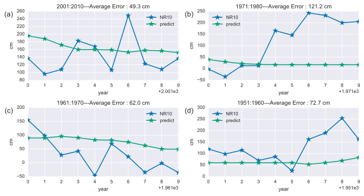


    <matplotlib.figure.Figure at 0xba12ef0>


    <matplotlib.figure.Figure at 0xb8483c8>


    <matplotlib.figure.Figure at 0xb848a20>


    <matplotlib.figure.Figure at 0xb94e518>


```python
bm_20.test_results.BM_Error[0].mean()
```


    49.32000000000001


```python
bm20 = bm_20.test_results.copy()
```


```python
bm20.BM_Error[0].mean()
```


    49.32000000000001


## Basic Model - Percentil 1


```python
reload(foracast_models)

bm_01 = foracast_models.basic_forecast()

bm_01.set_parameters(forecast_parameters,1,r_stat,cotg)

bm_01.forecast(cotg)
```


```python
grid_kws = {"height_ratios": (.5,.5), "hspace": (0.40)}
f, ((ax,ax1),(ax2,ax3)) = plt.subplots(2,2, gridspec_kw=grid_kws,figsize=(10,5))
ax_t = [ax,ax1,ax2,ax3]
for i in range(len(forecast_parameters)):
    a = ax_t[i]
    fig = plt.figure(figsize=(4,2))
    bm_01.test_results['BM_nr'][i].plot(marker='*',markersize=10,ax=ax_t[i])
    bm_01.test_results['BM_Prediction'][i].plot(marker='*',markersize=10,ax=ax_t[i])
    #bm_01.test_results['BM_Error'][i].plot(kind='bar')
    #plt.yticks(range(0,100,10))
    a.legend(loc='best')
    a.set_ylabel('cm')
    a.set_title(str(bm_01.forecast_parameters.ix[i:i,1:2].values[0][0]+bm_01.forecast_parameters.ix[i:i,3:4].values[0][0])+
              ':'+str(bm_01.forecast_parameters.ix[i:i,1:2].values[0][0]+bm_01.forecast_parameters.ix[i:i,3:4].values[0][0]+
              bm_01.forecast_parameters.ix[i:i,3:4].values[0][0]-1) + '---Average Error : '+str(round(bm_01.test_results['BM_Error'][i].mean(),1))+' cm')
ax.text(-0.1, 1., '(a)', transform=ax.transAxes,
  fontsize=12, va='top', ha='right')
ax1.text(-0.1, 1., '(b)', transform=ax1.transAxes,
      fontsize=12, va='top', ha='right')
ax2.text(-0.1, 1., '(c)', transform=ax2.transAxes,
  fontsize=12, va='top', ha='right')
ax3.text(-0.1, 1., '(d)', transform=ax3.transAxes,
      fontsize=12, va='top', ha='right')   
f.savefig(figuras+'bm_1_teste_multiple.pdf',bbox_inches='tight')
    #plt.show()
```


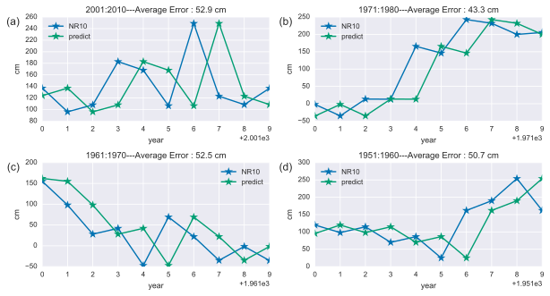


    <matplotlib.figure.Figure at 0xe3f6ba8>


    <matplotlib.figure.Figure at 0xe4e0320>


    <matplotlib.figure.Figure at 0xe4e0358>


    <matplotlib.figure.Figure at 0xe4e0128>


## AR(1)


```python
rc('font',family='Senasds Serif',size=10)
sns.set_style("darkgrid")
sns.set(palette="colorblind")
sns.set_context("paper")
```


```python
reload(foracast_models)
```


    <module 'foracast_models' from 'foracast_models.pyc'>


```python
ar_test_1 = foracast_models.auto_regression()
```


```python
ar_test_1.set_parameters(forecast_parameters,1,r_stat,cotg)
```


```python
ar_test_1.forecast()
```


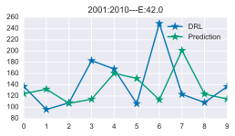


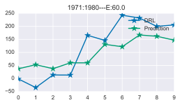


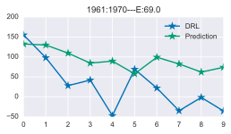


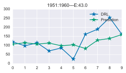


```python
grid_kws = {"height_ratios": (.5,.5), "hspace": (0.40)}
f, ((ax,ax1),(ax2,ax3)) = plt.subplots(2,2, gridspec_kw=grid_kws,figsize=(10,5))

ax_t = [ax,ax1,ax2,ax3]
for i in range(len(forecast_parameters)):
    a = ax_t[i]
    ar_test_1.test_results_summary[i].index = ar_test_1.test_results_summary[i].Years
    ar_test_1.test_results_summary[i]['DRL'].plot(marker='*',markersize=10,ax=ax_t[i])
    
    ar_test_1.test_results_summary[i]['Prediction'].plot(marker='*',markersize=10,ax=ax_t[i])
    #self.test_results['Error'].plot(kind='bar')
    #plt.yticks(range(0,100,10))
    a.legend(loc='best')
    a.set_ylabel('cm')
    a.set_title(str(ar_test_1.forecast_parameters.ix[i:i,1:2].values[0][0]+ar_test_1.forecast_parameters.ix[i:i,3:4].values[0][0])+
              ':'+str(ar_test_1.forecast_parameters.ix[i:i,1:2].values[0][0]+ar_test_1.forecast_parameters.ix[i:i,3:4].values[0][0]+
              ar_test_1.forecast_parameters.ix[i:i,3:4].values[0][0]-1) + '---Average Error : '+str(round(ar_test_1.test_results_summary[i]['Error'].mean(),1))+' cm')
ax.text(-0.1, 1., '(a)', transform=ax.transAxes,
  fontsize=12, va='top', ha='right')
ax1.text(-0.1, 1., '(b)', transform=ax1.transAxes,
      fontsize=12, va='top', ha='right')
ax2.text(-0.1, 1., '(c)', transform=ax2.transAxes,
  fontsize=12, va='top', ha='right')
ax3.text(-0.1, 1., '(d)', transform=ax3.transAxes,
      fontsize=12, va='top', ha='right')
f.savefig(figuras+'ar1_teste_multiple.pdf',bbox_inches='tight')
```


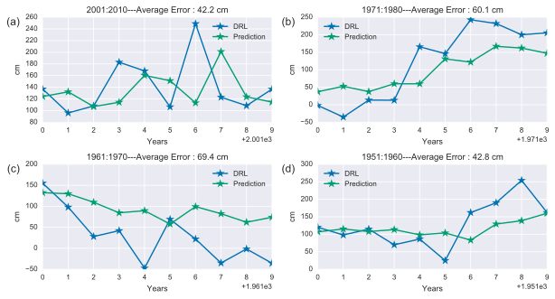


## MR


```python
reload(foracast_models)
```


    <module 'foracast_models' from 'foracast_models.pyc'>


```python
mr1 =  foracast_models.multiple_regression()
```


```python
mr1.set_parameters(forecast_parameters,1,r_stat,cotg,12)
```


```python
mr1.forecast()
```


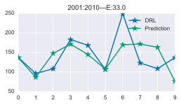


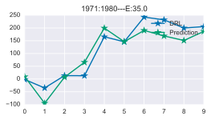


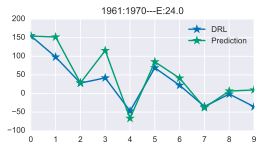


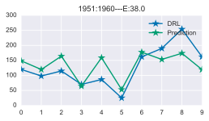


```python
mr1.forecast_results.Error.mean()
```


    32.42261497444389


```python
grid_kws = {"height_ratios": (.5,.5), "hspace": (0.40)}
f, ((ax,ax1),(ax2,ax3)) = plt.subplots(2,2, gridspec_kw=grid_kws,figsize=(10,5))
ax_t = [ax,ax1,ax2,ax3]
for i in range(len(forecast_parameters)):
    a = ax_t[i]
    mr1.test_results_summary[i].index = mr1.test_results_summary[i].Years
    mr1.test_results_summary[i]['DRL'].plot(marker='*',markersize=10,ax=ax_t[i])
    
    mr1.test_results_summary[i]['Prediction'].plot(marker='*',markersize=10,ax=ax_t[i])
    #self.test_results['Error'].plot(kind='bar')
    #plt.yticks(range(0,100,10))
    a.legend(loc='best')
    a.set_ylabel('cm')
    a.set_title(str(mr1.forecast_parameters.ix[i:i,1:2].values[0][0]+mr1.forecast_parameters.ix[i:i,3:4].values[0][0])+
              ':'+str(mr1.forecast_parameters.ix[i:i,1:2].values[0][0]+mr1.forecast_parameters.ix[i:i,3:4].values[0][0]+
              mr1.forecast_parameters.ix[i:i,3:4].values[0][0]-1) + '---Average Error : '+str(round(mr1.test_results_summary[i]['Error'].mean(),1))+' cm')
ax.text(-0.1, 1., '(a)', transform=ax.transAxes,
  fontsize=12, va='top', ha='right')
ax1.text(-0.1, 1., '(b)', transform=ax1.transAxes,
      fontsize=12, va='top', ha='right')
ax2.text(-0.1, 1., '(c)', transform=ax2.transAxes,
  fontsize=12, va='top', ha='right')
ax3.text(-0.1, 1., '(d)', transform=ax3.transAxes,
      fontsize=12, va='top', ha='right')
f.savefig(figuras+'mr1_teste_multiple.pdf',bbox_inches='tight')
```


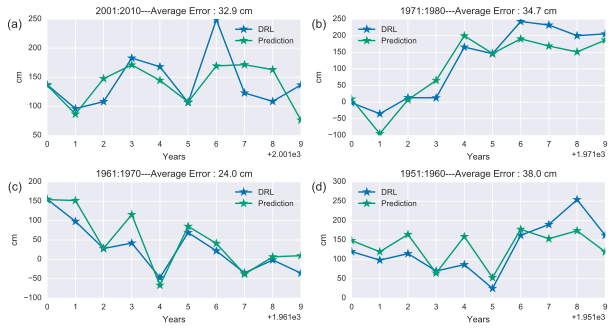


## ANN


```python
models = []
for i in range(1949,2010):
    models.append(pd.read_pickle('best_result'+str(i)+'.P')[0][0])
```


```python
def forecast_error(s_model):
    s_model.test_prediction2 = s_model.network.activate(s_model.test_values_x_norm.values[0])
    print(s_model.test_values_y_norm.index)
    ymax = s_model.training_values_y.max()
    ymin = s_model.training_values_y.min()
    ypredict = pd.DataFrame((np.array(s_model.test_prediction2)*(ymax-ymin))+ymin)
    yreal = pd.DataFrame((np.array(s_model.test_values_y_norm)*(ymax-ymin))+ymin)
    return([abs(yreal[0].values[0] -ypredict[0].values[0]),ypredict[0].values[0], yreal[0].values[0]])
```


```python
error_results= map(lambda x: forecast_error(models[x]),range(len(models)))
```

    Int64Index([1951], dtype='int64', name=u'Ano2')
    Int64Index([1952], dtype='int64', name=u'Ano2')
    Int64Index([1953], dtype='int64', name=u'Ano2')
    Int64Index([1954], dtype='int64', name=u'Ano2')
    Int64Index([1955], dtype='int64', name=u'Ano2')
    Int64Index([1956], dtype='int64', name=u'Ano2')
    Int64Index([1957], dtype='int64', name=u'Ano2')
    Int64Index([1958], dtype='int64', name=u'Ano2')
    Int64Index([1959], dtype='int64', name=u'Ano2')
    Int64Index([1960], dtype='int64', name=u'Ano2')
    Int64Index([1961], dtype='int64', name=u'Ano2')
    Int64Index([1962], dtype='int64', name=u'Ano2')
    Int64Index([1963], dtype='int64', name=u'Ano2')
    Int64Index([1964], dtype='int64', name=u'Ano2')
    Int64Index([1965], dtype='int64', name=u'Ano2')
    Int64Index([1966], dtype='int64', name=u'Ano2')
    Int64Index([1967], dtype='int64', name=u'Ano2')
    Int64Index([1968], dtype='int64', name=u'Ano2')
    Int64Index([1969], dtype='int64', name=u'Ano2')
    Int64Index([1970], dtype='int64', name=u'Ano2')
    Int64Index([1971], dtype='int64', name=u'Ano2')
    Int64Index([1972], dtype='int64', name=u'Ano2')
    Int64Index([1973], dtype='int64', name=u'Ano2')
    Int64Index([1974], dtype='int64', name=u'Ano2')
    Int64Index([1975], dtype='int64', name=u'Ano2')
    Int64Index([1976], dtype='int64', name=u'Ano2')
    Int64Index([1977], dtype='int64', name=u'Ano2')
    Int64Index([1978], dtype='int64', name=u'Ano2')
    Int64Index([1979], dtype='int64', name=u'Ano2')
    Int64Index([1980], dtype='int64', name=u'Ano2')
    Int64Index([1981], dtype='int64', name=u'Ano2')
    Int64Index([1982], dtype='int64', name=u'Ano2')
    Int64Index([1983], dtype='int64', name=u'Ano2')
    Int64Index([1984], dtype='int64', name=u'Ano2')
    Int64Index([1985], dtype='int64', name=u'Ano2')
    Int64Index([1986], dtype='int64', name=u'Ano2')
    Int64Index([1987], dtype='int64', name=u'Ano2')
    Int64Index([1988], dtype='int64', name=u'Ano2')
    Int64Index([1989], dtype='int64', name=u'Ano2')
    Int64Index([1990], dtype='int64', name=u'Ano2')
    Int64Index([1991], dtype='int64', name=u'Ano2')
    Int64Index([1992], dtype='int64', name=u'Ano2')
    Int64Index([1993], dtype='int64', name=u'Ano2')
    Int64Index([1994], dtype='int64', name=u'Ano2')
    Int64Index([1995], dtype='int64', name=u'Ano2')
    Int64Index([1996], dtype='int64', name=u'Ano2')
    Int64Index([1997], dtype='int64', name=u'Ano2')
    Int64Index([1998], dtype='int64', name=u'Ano2')
    Int64Index([1999], dtype='int64', name=u'Ano2')
    Int64Index([2000], dtype='int64', name=u'Ano2')
    Int64Index([2001], dtype='int64', name=u'Ano2')
    Int64Index([2002], dtype='int64', name=u'Ano2')
    Int64Index([2003], dtype='int64', name=u'Ano2')
    Int64Index([2004], dtype='int64', name=u'Ano2')
    Int64Index([2005], dtype='int64', name=u'Ano2')
    Int64Index([2006], dtype='int64', name=u'Ano2')
    Int64Index([2007], dtype='int64', name=u'Ano2')
    Int64Index([2008], dtype='int64', name=u'Ano2')
    Int64Index([2009], dtype='int64', name=u'Ano2')
    Int64Index([2010], dtype='int64', name=u'Ano2')
    Int64Index([2011], dtype='int64', name=u'Ano2')
    


```python
error_results  = pd.DataFrame(error_results)
```


```python
error_results.columns = ['Error', 'Predict', 'Real']
```


```python
error_results.head(5)
```


<div>
<table border="1" class="dataframe">
  <thead>
    <tr style="text-align: right;">
      <th></th>
      <th>Error</th>
      <th>Predict</th>
      <th>Real</th>
    </tr>
  </thead>
  <tbody>
    <tr>
      <th>0</th>
      <td>27.407476</td>
      <td>147.407476</td>
      <td>120.0</td>
    </tr>
    <tr>
      <th>1</th>
      <td>32.673703</td>
      <td>130.673703</td>
      <td>98.0</td>
    </tr>
    <tr>
      <th>2</th>
      <td>33.517670</td>
      <td>148.317670</td>
      <td>114.8</td>
    </tr>
    <tr>
      <th>3</th>
      <td>28.107450</td>
      <td>41.892550</td>
      <td>70.0</td>
    </tr>
    <tr>
      <th>4</th>
      <td>47.516327</td>
      <td>133.916327</td>
      <td>86.4</td>
    </tr>
  </tbody>
</table>
</div>


```python
error_results.index = range(1951,2012)
```


```python
error_results.plot(marker='*')
```


    <matplotlib.axes._subplots.AxesSubplot at 0x167ea550>


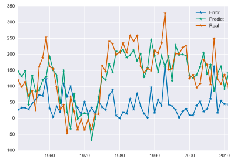


```python
error_results.Error.mean()
```


    44.59860812768862


```python
plt.figure(figsize(4,2))
error_results.ix[1951:1960,1:].plot(marker='*')
error_results.ix[1951:1960,:1].describe()
```


<div>
<table border="1" class="dataframe">
  <thead>
    <tr style="text-align: right;">
      <th></th>
      <th>Error</th>
    </tr>
  </thead>
  <tbody>
    <tr>
      <th>count</th>
      <td>10.000000</td>
    </tr>
    <tr>
      <th>mean</th>
      <td>52.701568</td>
    </tr>
    <tr>
      <th>std</th>
      <td>30.408949</td>
    </tr>
    <tr>
      <th>min</th>
      <td>27.407476</td>
    </tr>
    <tr>
      <th>25%</th>
      <td>31.867501</td>
    </tr>
    <tr>
      <th>50%</th>
      <td>40.516998</td>
    </tr>
    <tr>
      <th>75%</th>
      <td>67.483455</td>
    </tr>
    <tr>
      <th>max</th>
      <td>123.858894</td>
    </tr>
  </tbody>
</table>
</div>


    <matplotlib.figure.Figure at 0x2a955a58>


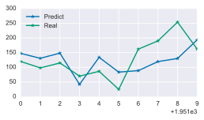


```python
plt.figure(figsize(4,2))
error_results.ix[1961:1970,1:].plot(marker='*')
error_results.ix[1961:1970,:1].describe()
```


<div>
<table border="1" class="dataframe">
  <thead>
    <tr style="text-align: right;">
      <th></th>
      <th>Error</th>
    </tr>
  </thead>
  <tbody>
    <tr>
      <th>count</th>
      <td>10.000000</td>
    </tr>
    <tr>
      <th>mean</th>
      <td>49.020327</td>
    </tr>
    <tr>
      <th>std</th>
      <td>35.325122</td>
    </tr>
    <tr>
      <th>min</th>
      <td>3.977517</td>
    </tr>
    <tr>
      <th>25%</th>
      <td>22.650800</td>
    </tr>
    <tr>
      <th>50%</th>
      <td>44.988707</td>
    </tr>
    <tr>
      <th>75%</th>
      <td>64.094619</td>
    </tr>
    <tr>
      <th>max</th>
      <td>108.504943</td>
    </tr>
  </tbody>
</table>
</div>


    <matplotlib.figure.Figure at 0x2aaab0b8>


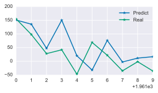


```python
plt.figure(figsize(4,2))
error_results.ix[1971:1980,1:].plot(marker='*')
error_results.ix[1971:1980,:1].describe()
```


<div>
<table border="1" class="dataframe">
  <thead>
    <tr style="text-align: right;">
      <th></th>
      <th>Error</th>
    </tr>
  </thead>
  <tbody>
    <tr>
      <th>count</th>
      <td>10.000000</td>
    </tr>
    <tr>
      <th>mean</th>
      <td>34.909295</td>
    </tr>
    <tr>
      <th>std</th>
      <td>28.435188</td>
    </tr>
    <tr>
      <th>min</th>
      <td>0.189861</td>
    </tr>
    <tr>
      <th>25%</th>
      <td>14.664426</td>
    </tr>
    <tr>
      <th>50%</th>
      <td>29.616578</td>
    </tr>
    <tr>
      <th>75%</th>
      <td>48.774510</td>
    </tr>
    <tr>
      <th>max</th>
      <td>88.567557</td>
    </tr>
  </tbody>
</table>
</div>


    <matplotlib.figure.Figure at 0xe8bfba8>


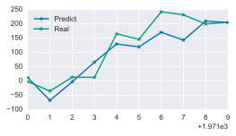


```python
plt.figure(figsize(4,2))
error_results.ix[1991:2000,1:].plot(marker='*')
error_results.ix[1991:2000,:1].describe()
```


<div>
<table border="1" class="dataframe">
  <thead>
    <tr style="text-align: right;">
      <th></th>
      <th>Error</th>
    </tr>
  </thead>
  <tbody>
    <tr>
      <th>count</th>
      <td>10.000000</td>
    </tr>
    <tr>
      <th>mean</th>
      <td>43.959839</td>
    </tr>
    <tr>
      <th>std</th>
      <td>46.912077</td>
    </tr>
    <tr>
      <th>min</th>
      <td>1.931625</td>
    </tr>
    <tr>
      <th>25%</th>
      <td>22.597961</td>
    </tr>
    <tr>
      <th>50%</th>
      <td>34.866325</td>
    </tr>
    <tr>
      <th>75%</th>
      <td>42.104411</td>
    </tr>
    <tr>
      <th>max</th>
      <td>168.940300</td>
    </tr>
  </tbody>
</table>
</div>


    <matplotlib.figure.Figure at 0x1609da20>


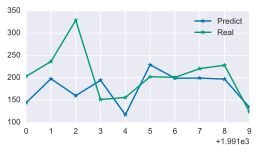


```python
plt.figure(figsize(4,2))
error_results.ix[2001:2010,1:].plot(marker='*')
error_results.ix[2001:2010,:1].describe()
```


<div>
<table border="1" class="dataframe">
  <thead>
    <tr style="text-align: right;">
      <th></th>
      <th>Error</th>
    </tr>
  </thead>
  <tbody>
    <tr>
      <th>count</th>
      <td>10.000000</td>
    </tr>
    <tr>
      <th>mean</th>
      <td>49.706973</td>
    </tr>
    <tr>
      <th>std</th>
      <td>43.174452</td>
    </tr>
    <tr>
      <th>min</th>
      <td>10.269644</td>
    </tr>
    <tr>
      <th>25%</th>
      <td>23.677782</td>
    </tr>
    <tr>
      <th>50%</th>
      <td>42.408782</td>
    </tr>
    <tr>
      <th>75%</th>
      <td>54.412581</td>
    </tr>
    <tr>
      <th>max</th>
      <td>162.516778</td>
    </tr>
  </tbody>
</table>
</div>


    <matplotlib.figure.Figure at 0x1629a550>


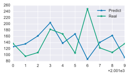


```python
a = error_results.ix[1951:1960,:1]
b =error_results.ix[1961:1970,:1]
c = error_results.ix[1971:1980,:1]
d = error_results.ix[2001:2010,:1]
```


```python
a.values
```


    array([[  27.40747588],
           [  32.67370332],
           [  33.51766954],
           [  28.10745027],
           [  47.51632705],
           [  58.62055761],
           [  73.27708471],
           [  70.43775374],
           [ 123.85889354],
           [  31.59876737]])


```python
plt.boxplot([a.values,b.values,c.values,d.values])
plt.show()
```


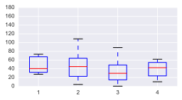


```python
models[0].monthly_values.tail(10).to_latex('monthly_values2.tex')
```


```python
error_results.columns = [u'Error', u'Predict', u'DRL']
```


```python
error_results.ix[2001:2010].Error.mean()
```


    49.70697319584216


```python
grid_kws = {"height_ratios": (.5,.5), "hspace": (0.40)}
f, ((ax,ax1),(ax2,ax3)) = plt.subplots(2,2, gridspec_kw=grid_kws,figsize=(10,5))
ax_t = [ax,ax1,ax2,ax3]


error_results.ix[2001:2010,1:].plot(marker='*',markersize=10,ax=ax)
error_results.ix[1971:1980,1:].plot(marker='*',markersize=10,ax=ax1)
error_results.ix[1961:1970,1:].plot(marker='*',markersize=10,ax=ax2)
error_results.ix[1951:1960,1:].plot(marker='*',markersize=10,ax=ax3)


    #self.test_results['Error'].plot(kind='bar')
    #plt.yticks(range(0,100,10))
ax.text(-0.1, 1., '(a)', transform=ax.transAxes,
  fontsize=12, va='top', ha='right')
ax1.text(-0.1, 1., '(b)', transform=ax1.transAxes,
      fontsize=12, va='top', ha='right')
ax2.text(-0.1, 1., '(c)', transform=ax2.transAxes,
  fontsize=12, va='top', ha='right')
ax3.text(-0.1, 1., '(d)', transform=ax3.transAxes,
      fontsize=12, va='top', ha='right')

ax.legend(loc='best')
ax.set_ylabel('cm')
ax.set_xlabel('Years')
i = 0
ax.set_title(str(ar_test_1.forecast_parameters.ix[i:i,1:2].values[0][0]+ar_test_1.forecast_parameters.ix[i:i,3:4].values[0][0])+
          ':'+str(ar_test_1.forecast_parameters.ix[i:i,1:2].values[0][0]+ar_test_1.forecast_parameters.ix[i:i,3:4].values[0][0]+
          ar_test_1.forecast_parameters.ix[i:i,3:4].values[0][0]-1) + '---Average Error : '+str(round(error_results.ix[2001:2010].Error.mean(),1))+' cm')

i = 1
ax1.set_title(str(ar_test_1.forecast_parameters.ix[i:i,1:2].values[0][0]+ar_test_1.forecast_parameters.ix[i:i,3:4].values[0][0])+
          ':'+str(ar_test_1.forecast_parameters.ix[i:i,1:2].values[0][0]+ar_test_1.forecast_parameters.ix[i:i,3:4].values[0][0]+
          ar_test_1.forecast_parameters.ix[i:i,3:4].values[0][0]-1) + '---Average Error : '+str(round(error_results.ix[1971:1980].Error.mean(),1))+' cm')
ax1.legend(loc='best')
ax1.set_ylabel('cm')
ax1.set_xlabel('Years')


i = 2
ax2.set_title(str(ar_test_1.forecast_parameters.ix[i:i,1:2].values[0][0]+ar_test_1.forecast_parameters.ix[i:i,3:4].values[0][0])+
          ':'+str(ar_test_1.forecast_parameters.ix[i:i,1:2].values[0][0]+ar_test_1.forecast_parameters.ix[i:i,3:4].values[0][0]+
          ar_test_1.forecast_parameters.ix[i:i,3:4].values[0][0]-1) + '---Average Error : '+str(round(error_results.ix[1961:1970].Error.mean(),1))+' cm')
ax2.legend(loc='best')
ax2.set_ylabel('cm')
ax2.set_xlabel('Years')


i = 3
ax3.set_title(str(ar_test_1.forecast_parameters.ix[i:i,1:2].values[0][0]+ar_test_1.forecast_parameters.ix[i:i,3:4].values[0][0])+
          ':'+str(ar_test_1.forecast_parameters.ix[i:i,1:2].values[0][0]+ar_test_1.forecast_parameters.ix[i:i,3:4].values[0][0]+
          ar_test_1.forecast_parameters.ix[i:i,3:4].values[0][0]-1) + '---Average Error : '+str(round(error_results.ix[1951:1960].Error.mean(),1))+' cm')
ax3.legend(loc='best')
ax3.set_ylabel('cm')
ax3.set_xlabel('Years')


f.savefig(figuras+'ann_teste_multiple.pdf',bbox_inches='tight')
```


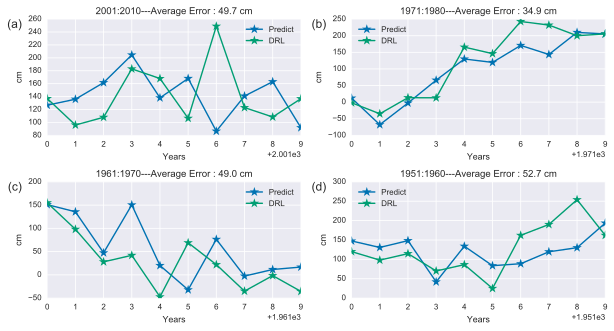


# ERROR SUMMARY


```python
from seaborn import boxplot
sns.set_context("paper")
a = [[2001,2010],[1971,1980],[1961,1970],[1951,1960]]
grid_kws = {"height_ratios": (.5,.5), "hspace": (0.25), "wspace": (0.15)}
f, ((ax,ax1),(ax2,ax3)) = plt.subplots(2,2, gridspec_kw=grid_kws,figsize=(9,3.5))
ax_t = [ax,ax1,ax2,ax3]
for i in range(4):
    axis = ax_t[i]
    grafico=pd.DataFrame()
    
    grafico['A'] = bm20.BM_Error[i]
    grafico['B'] = bm_01.test_results.BM_Error[i]
    grafico['C'] = ar_test_1.test_results_summary[i].Error
    grafico['D'] = mr1.test_results_summary[i].Error
    grafico['E'] = error_results.ix[a[i][0]:a[i][1]].Error
    boxplot(grafico,fliersize=10,whis=200,width=0.4,linewidth=0.8,showmeans=False,ax=ax_t[i],vert=0,color='Black', palette=sns.cubehelix_palette(5,12,dark=0.3,rot=-.20))#palette=sns.cubehelix_palette(6,12,rot=-.15))
    
    axis.set_title(str(a[i][0])+':'+str(a[i][1]))
    #ax2.legend(loc='best')
    #axis.set_xlabel('Error (cm)')
    #axis.set_ylabel('Methods')
    axis.set_xlim(0,200)
    axis.set_xticks(range(0,250,20))
    
    axis.scatter(grafico.mean(),[0,1,2,3,4],c='r',marker='s',s=10)
    
    title = str(a[i][0])+':'+ str(a[i][1])
    axis.set_title(title,x=0.98,y=0.68,rotation='vertical')
    
    
f.text(0.09,0.5, 'Methods', ha='center', va='center',rotation='vertical')
f.text(0.5,0.01, 'Error (cm)', ha='center', va='center',rotation='horizontal')    


ax.text(0.93, .15, '(i)', transform=ax.transAxes,
  fontsize=12, va='top', ha='left')
ax1.text(0.93, .15, '(ii)', transform=ax1.transAxes,
      fontsize=12, va='top', ha='left')
ax2.text(0.93, .15, '(iii)', transform=ax2.transAxes,
  fontsize=12, va='top', ha='left')
ax3.text(0.93, .15, '(iv)', transform=ax3.transAxes,
      fontsize=12, va='top', ha='left')


f.savefig(figuras+'\\boxplota_.pdf',bbox_inches='tight')
```

    C:\Anaconda\lib\site-packages\seaborn\categorical.py:2125: UserWarning: The boxplot API has been changed. Attempting to adjust your arguments for the new API (which might not work). Please update your code. See the version 0.6 release notes for more info.
      warnings.warn(msg, UserWarning)
    


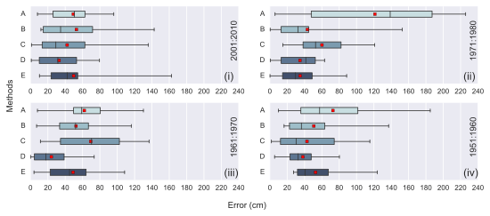


```python
sns.set_context("paper")
#rc('font',family='Senasds Serif',size=10)
a = [[2001,2010],[1971,1980],[1961,1970],[1951,1960]]
grid_kws = {"height_ratios": (.5,.5), "hspace": (0.25), "wspace": (0.15)}
f, ((ax,ax1),(ax2,ax3)) = plt.subplots(2,2, gridspec_kw=grid_kws,figsize=(9,3.5))
ax_t = [ax,ax1,ax2,ax3]
for i in range(4):
    axis = ax_t[i]
    grafico=pd.DataFrame()
    
    grafico['A'] = bm20.BM_Error[i]
    grafico['B'] = bm_01.test_results.BM_Error[i]
    grafico['C'] = ar_test_1.test_results_summary[i].Error
    grafico['D'] = mr1.test_results_summary[i].Error
    grafico['E'] = error_results.ix[a[i][0]:a[i][1]].Error
    grafico.index =grafico.index.astype('int')
    #boxplot(grafico,fliersize=10,whis=200,width=0.4,linewidth=0.8,showmeans=False,ax=ax_t[i],vert=0,color='Black', palette=sns.cubehelix_palette(5,12,dark=0.3,rot=-.20))#palette=sns.cubehelix_palette(6,12,rot=-.15))
    
    #axis.set_title(str(a[i][0])+':'+str(a[i][1]))
    #ax2.legend(loc='best')
    #axis.set_xlabel('Error (cm)')
    #axis.set_ylabel('Methods')
    
    cbar_ax = f.add_axes([.94, .2, .02,0.5])
    title = str(a[i][0])+':'+ str(a[i][1])
    axis.set_title(title,x=1.03,y=0.45,rotation='vertical')
    sns.heatmap(grafico.T,ax=axis,annot=True,cmap='inferno',cbar=i/3. == 0,fmt='3.0f',vmin=0, vmax=250,linewidths=.5,square=0,cbar_ax=cbar_ax)#cbar_kws={"orientation": "horizontal"}
    axis.set_xlabel('')
    axis.set_yticklabels(axis.yaxis.get_majorticklabels(), rotation=0)
    
    
ax.text(1.01, .95, '(i)', transform=ax.transAxes,
  fontsize=12, va='top', ha='left')
ax1.text(1.01, .95, '(ii)', transform=ax1.transAxes,
      fontsize=12, va='top', ha='left')
ax2.text(1.01, .95, '(iii)', transform=ax2.transAxes,
  fontsize=12, va='top', ha='left')
ax3.text(1.01, .95, '(iv)', transform=ax3.transAxes,
      fontsize=12, va='top', ha='left')

f.text(0.09,0.5, 'Methods', ha='center', va='center',rotation='vertical')
f.text(0.5,0.01, 'Years', ha='center', va='center',rotation='horizontal')  

plt.text(0.15,0.6,'Error (cm)',rotation=90,color='white')
f.savefig(figuras+'\\error_.pdf',bbox_inches='tight')
```


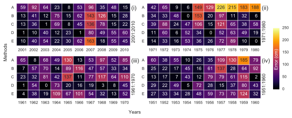


```python
bm_01.test_results.BM_Error[1].describe()
```


    count     10.000000
    mean      43.270000
    std       47.199107
    min        0.400000
    25%       13.000000
    50%       32.500000
    75%       44.700000
    max      152.600000
    Name: erro, dtype: float64


```python
# Erro médio BM20
print(pd.DataFrame(map(lambda x: bm20.BM_Error[x].mean(),range(4))).describe())

# Erro médio BM01
print(pd.DataFrame(map(lambda x: bm_01.test_results.BM_Error[x].mean(),range(4))).describe())

# Erro médio AR01
print(pd.DataFrame(map(lambda x: ar_test_1.test_results_summary[x].Error.mean(),range(4))).describe())

# Erro médio MR
print(pd.DataFrame(map(lambda x:  mr1.test_results_summary[x].Error.mean(),range(4))).describe())

# Erro médio ARR
print(pd.DataFrame(map(lambda x:  error_results.ix[a[x][0]:a[x][1]].Error.mean(),range(4))).describe())
```

                    0
    count    4.000000
    mean    76.292500
    std     31.397035
    min     49.320000
    25%     58.815000
    50%     67.350000
    75%     84.827500
    max    121.150000
                   0
    count   4.000000
    mean   49.836250
    std     4.479846
    min    43.270000
    25%    48.842500
    50%    51.590000
    75%    52.583750
    max    52.895000
                   0
    count   4.000000
    mean   53.645027
    std    13.395840
    min    42.225344
    25%    42.667534
    50%    51.470810
    75%    62.448303
    max    69.413144
                   0
    count   4.000000
    mean   32.422615
    std     6.013531
    min    23.977099
    25%    30.700283
    50%    33.836416
    75%    35.558748
    max    38.040529
                   0
    count   4.000000
    mean   46.584541
    std     7.945901
    min    34.909295
    25%    45.492569
    50%    49.363650
    75%    50.455622
    max    52.701568
    


```python
A = []
B = []
C = []
D = []
E = []
```


```python
# Erro médio BM20
map(lambda x: A.append(bm20.BM_Error[x].tolist()),range(4))

# Erro médio BM01
map(lambda x: B.append(bm_01.test_results.BM_Error[x].tolist()),range(4))

# Erro médio AR01
map(lambda x: C.append(ar_test_1.test_results_summary[x].Error.tolist()),range(4))

# Erro médio MR
map(lambda x:  D.append(mr1.test_results_summary[x].Error.tolist()),range(4))

# Erro médio ARR
map(lambda x:  E.append(error_results.ix[a[x][0]:a[x][1]].Error.tolist()),range(4))
```


    [None, None, None, None]


```python
print(pd.DataFrame(np.array(A).reshape(40)).describe())
print(pd.DataFrame(np.array(B).reshape(40)).describe())
print(pd.DataFrame(np.array(C).reshape(40)).describe())
print(pd.DataFrame(np.array(D).reshape(40)).describe())
print(pd.DataFrame(np.array(E).reshape(40)).describe())
```

                    0
    count   40.000000
    mean    76.292500
    std     60.028443
    min      6.000000
    25%     35.000000
    50%     59.500000
    75%    100.300000
    max    225.800000
                    0
    count   40.000000
    mean    49.836250
    std     40.946457
    min      0.400000
    25%     16.700000
    50%     33.800000
    75%     65.500000
    max    152.600000
                    0
    count   40.000000
    mean    53.645027
    std     39.881994
    min      1.102385
    25%     16.645754
    50%     44.110157
    75%     78.797484
    max    136.690748
                   0
    count  40.000000
    mean   32.422615
    std    24.702287
    min     0.385941
    25%    10.776347
    50%    28.225354
    75%    52.343253
    max    80.219491
                    0
    count   40.000000
    mean    46.584541
    std     34.156718
    min      0.189861
    25%     25.199415
    50%     36.647157
    75%     59.393839
    max    162.516778
    


```python
resumo = pd.DataFrame()

resumo['A'] = pd.DataFrame(np.array(A).reshape(40)).describe()[0]
resumo['B'] = pd.DataFrame(np.array(B).reshape(40)).describe()[0]
resumo['C'] = pd.DataFrame(np.array(C).reshape(40)).describe()[0]
resumo['D'] = pd.DataFrame(np.array(D).reshape(40)).describe()[0]
resumo['E'] = pd.DataFrame(np.array(E).reshape(40)).describe()[0]

#resumo.index = pd.DataFrame(np.array(A).reshape(40)).describe().index
```


```python
resumo.round(1)
```


<div>
<table border="1" class="dataframe">
  <thead>
    <tr style="text-align: right;">
      <th></th>
      <th>A</th>
      <th>B</th>
      <th>C</th>
      <th>D</th>
      <th>E</th>
    </tr>
  </thead>
  <tbody>
    <tr>
      <th>count</th>
      <td>40.0</td>
      <td>40.0</td>
      <td>40.0</td>
      <td>40.0</td>
      <td>40.0</td>
    </tr>
    <tr>
      <th>mean</th>
      <td>76.3</td>
      <td>49.8</td>
      <td>53.6</td>
      <td>32.4</td>
      <td>46.6</td>
    </tr>
    <tr>
      <th>std</th>
      <td>60.0</td>
      <td>40.9</td>
      <td>39.9</td>
      <td>24.7</td>
      <td>34.2</td>
    </tr>
    <tr>
      <th>min</th>
      <td>6.0</td>
      <td>0.4</td>
      <td>1.1</td>
      <td>0.4</td>
      <td>0.2</td>
    </tr>
    <tr>
      <th>25%</th>
      <td>35.0</td>
      <td>16.7</td>
      <td>16.6</td>
      <td>10.8</td>
      <td>25.2</td>
    </tr>
    <tr>
      <th>50%</th>
      <td>59.5</td>
      <td>33.8</td>
      <td>44.1</td>
      <td>28.2</td>
      <td>36.6</td>
    </tr>
    <tr>
      <th>75%</th>
      <td>100.3</td>
      <td>65.5</td>
      <td>78.8</td>
      <td>52.3</td>
      <td>59.4</td>
    </tr>
    <tr>
      <th>max</th>
      <td>225.8</td>
      <td>152.6</td>
      <td>136.7</td>
      <td>80.2</td>
      <td>162.5</td>
    </tr>
  </tbody>
</table>
</div>


```python
resumo.round(1).to_latex(tabelas+'resumo_forecast_methods.tex')
```
